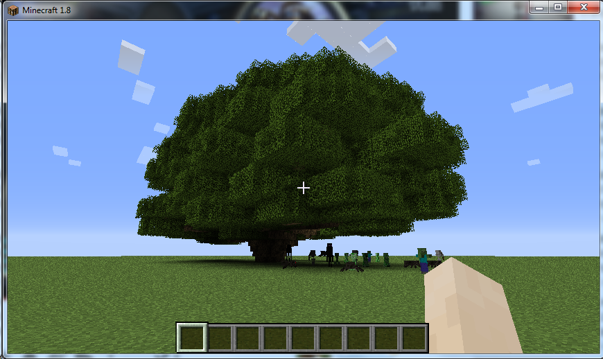
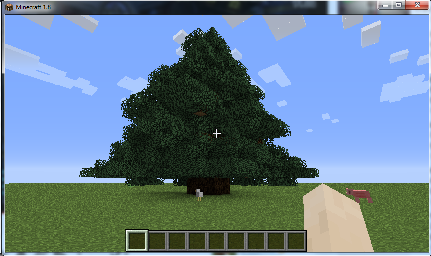
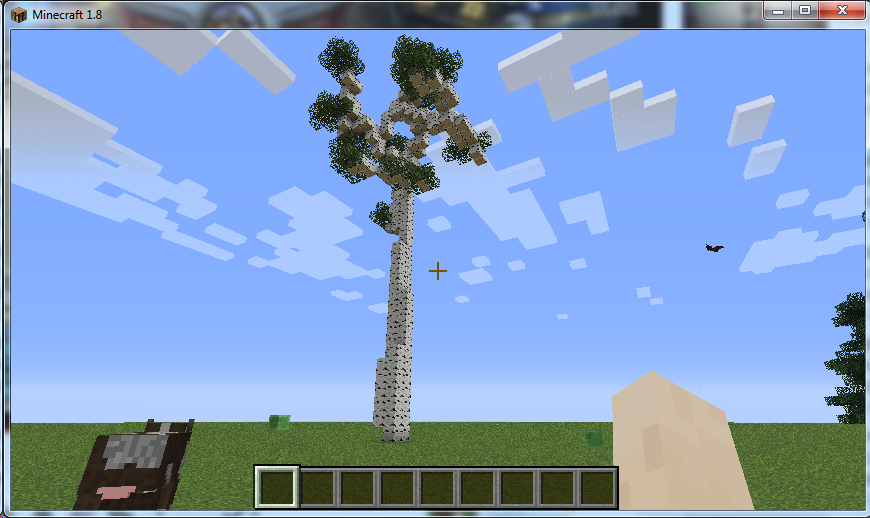
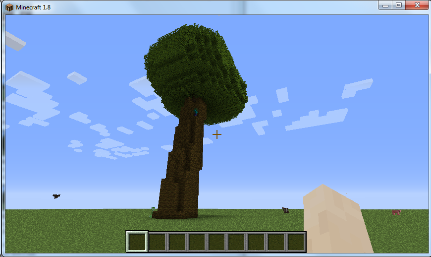
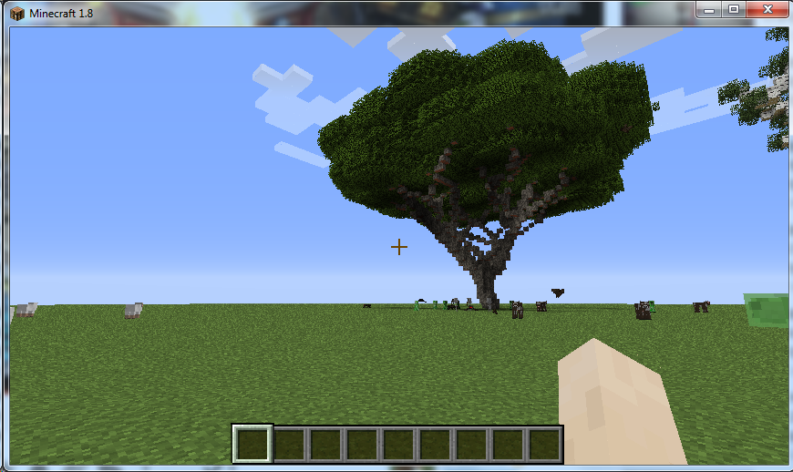

# World Tree mod for Mine Craft 1.8

## Versions

### 0.1
The initial version with only commandline functionality and 5 built-in tree types: Oak (DarkOak), Spruce, Birch, Jungle, and Acacia.

## Introduction

This is a mod for generating arbitrary size of trees. The motivation for writing this mod is to build a world tree automatically.

## Screenshots

Oak size=50

Spruce size=50

Birch size=50

Jungle size=50

Acacia size=50

## Installation

### For using it in Mine Craft client / server

1. Install [Mine Craft Forge 1.8](http://files.minecraftforge.net/minecraftforge/1.8) using the installer.
2. Put the .jar file from [build\libs](build\libs) into Mine Craft's mods folder.

### For source code

1. Install forge src following the [instructions](http://www.minecraftforge.net/wiki/Installation/Source)
2. Sync this repository into the forge src folder

## Basic Usage

Inside Mine Craft, type the following command to generate a tree on the point you are pointing at:

>/gt tree_type [size=n]

For example,

>/gt oak size=20

will generate an oak tree with height of 20 approximately.

Built-in tree types are Oak, DarkOak, Spruce, Birch, Jungle, and Acacia.

## Advanced Usage

You could modify any fields in [`Tree` class](src/main/java/com/leav/worldtree/Tree.java) with the annotation `@CommandLine` by commandline. For example,

>/gt oak size=20 crownShape=Cone crownTip=[0,10,0]

will generate an oak tree with cone shape.

## Algorithm

The main algorithm for branch generation is a particle-based method described in [Particle Systems for Plant Modeling](http://www.ibrarian.net/navon/paper/Particle_Systems_for_Plant_Modeling.pdf?paperid=10134025) by Yodthong Rodkaew, Prabhas Chongstitvatana, Suchada Siripant and Chidchanok Lursinsap.

The first step is to generate some amount of random "growthPoint"s within the crown shape. Then merge two closest growthPoints into a growthPoint towards the root of the tree, and repeat until we have one growthPoint left. Connect the last growthPoint to the root to form the last branch (or trunk).
